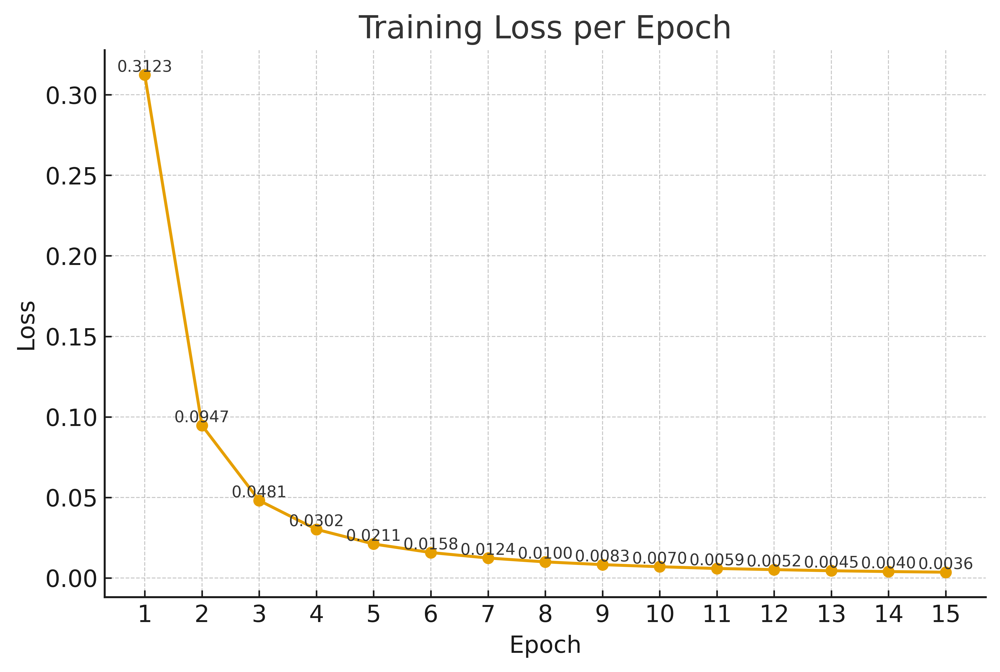

# Google MST-E Dataset Project

This project was developed using the **Google MST-E dataset**.

## Run and Test the Model

You can test the model using **FastAPI** by running:

```bash
uvicorn main:app --reload
````

Then open your browser and visit:

```
http://127.0.0.1:8000
```


## Sample Outputs

### 🔹 Random Sample of 30 Images


### 🔹 Training Loss per Epoch



